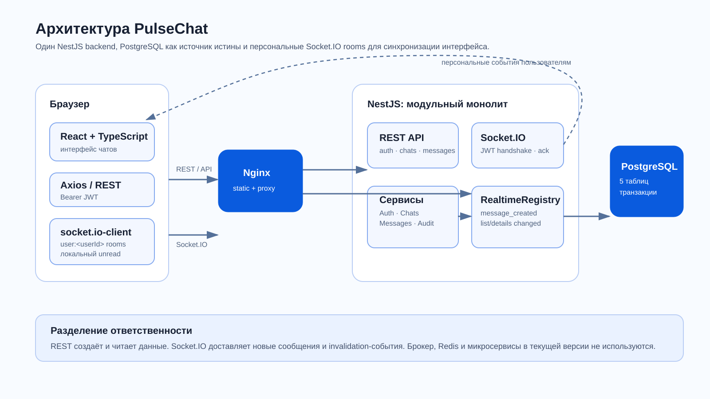
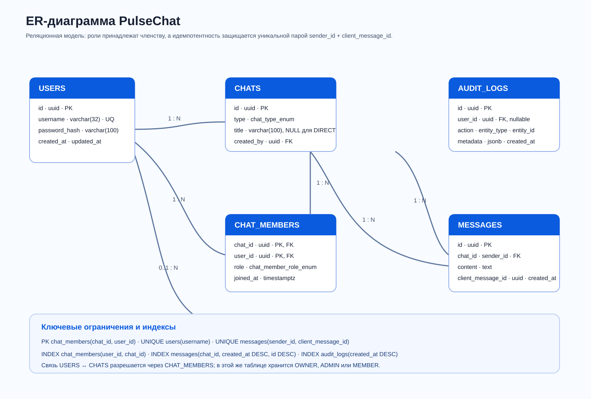
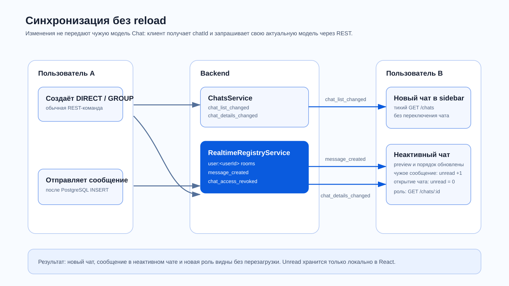
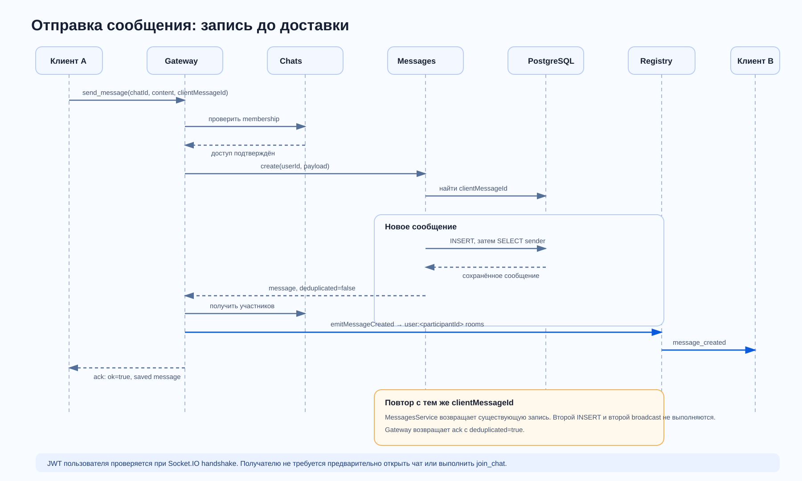

# Отчёт по практике

## PulseChat - веб-мессенджер

| Поле | Значение |
|---|---|
| Кейс | №1 «Мессенджер» |
| Проект | PulseChat |
| Техническое имя | `pulse-chat` |
| Автор | Андрей Потрикеев |
| Формат | Индивидуальный проект, вклад 100% |
| Год | 2026 |

## Содержание

1. [Предметная область](#1-предметная-область)
2. [Постановка задачи](#2-постановка-задачи)
3. [Анализ и приоритизация требований](#3-анализ-и-приоритизация-требований)
4. [Функциональные требования](#4-функциональные-требования)
5. [Нефункциональные требования](#5-нефункциональные-требования)
6. [Выбранный стек](#6-выбранный-стек)
7. [Архитектура](#7-архитектура)
8. [Модель данных и ER-диаграмма](#8-модель-данных-и-er-диаграмма)
9. [Описание таблиц](#9-описание-таблиц)
10. [Ограничения, индексы и удаление](#10-ограничения-индексы-и-удаление)
11. [Модель аутентификации и авторизации](#11-модель-аутентификации-и-авторизации)
12. [Роли и права](#12-роли-и-права)
13. [REST API](#13-rest-api)
14. [WebSocket API](#14-websocket-api)
15. [Алгоритм отправки сообщения](#15-алгоритм-отправки-сообщения)
16. [История и пагинация вверх](#16-история-и-пагинация-вверх)
17. [Поиск сообщений](#17-поиск-сообщений)
18. [Безопасность](#18-безопасность)
19. [Миграции, seed и SQL-скрипты](#19-миграции-seed-и-sql-скрипты)
20. [Frontend](#20-frontend)
21. [Тестирование](#21-тестирование)
22. [Инструкция по демонстрации](#22-инструкция-по-демонстрации)
23. [Ограничения MVP](#23-ограничения-mvp)
24. [Возможное развитие](#24-возможное-развитие)
25. [Выводы](#25-выводы)
26. [Источники](#26-источники)

## 1. Предметная область

Мессенджер обеспечивает обмен сообщениями между зарегистрированными пользователями. В предметной области есть пользователи, личные диалоги, групповые чаты, членство в чатах, роли, сообщения и журнал значимых действий.

Основные особенности области:

- пользователь видит только те чаты, в которых состоит;
- личный диалог связывает ровно двух пользователей и не имеет собственного названия;
- групповой чат имеет название, владельца, администраторов и участников;
- история должна сохраняться независимо от текущего WebSocket-соединения;
- событие реального времени ускоряет отображение, но PostgreSQL остаётся источником истины;
- потерянный ack не должен создавать дубликат при повторе запроса;
- поиск всегда ограничен одним доступным пользователю чатом.

## 2. Постановка задачи

Цель проекта - создать сервер и веб-клиент простого мессенджера, который демонстрирует полный обязательный сценарий кейса №1:

- регистрация и вход;
- JWT-аутентификация;
- список личных и групповых чатов;
- создание DIRECT и GROUP;
- отправка и получение сообщений в реальном времени;
- история с загрузкой предыдущих сообщений вверх;
- поиск по простой строке внутри выбранного чата;
- добавление и удаление участников администратором;
- три роли и минимальные привилегии;
- защита чужих чатов;
- миграции, seed, Docker и материалы для защиты.

Кейсы №2 «Поисковик/RAG» и №3 «Kanban» не входят в область решения.

## 3. Анализ и приоритизация требований

Требования и границы проекта определены официальными материалами практики.

| Приоритет | Источник | Роль |
|---:|---|---|
| 1 | `Вводная встреча.pdf` | Общие обязательные материалы, критерии ER, отчёта, ролей, авторизации и защиты |
| 1 | `messenger-1.pdf` | Обязательный минимум кейса: auth, чаты, real-time, история вверх, участники и поиск |
| 2 | `messenger_2.pdf` | Архитектурные возможности развития: retry, идемпотентность, брокеры, статусы и вложения |

`messenger-1.pdf` разрешает JWT без refresh и несколько вариантов real-time транспорта. В реализации выбран Socket.IO поверх WebSocket. `messenger_2.pdf` рассматривает развитие архитектуры; из него в MVP реализованы ack, retry и идемпотентность через `clientMessageId`. Брокер, вложения и server-side delivery/read receipts не входят в текущую версию.

Полная связь требования с кодом, артефактом и способом проверки приведена в [requirements-traceability.md](requirements-traceability.md).

## 4. Функциональные требования

### 4.1 Пользователи и доступ

- Регистрация с уникальным `username` и паролем не короче 8 символов.
- Вход с выдачей access JWT.
- Получение текущего пользователя.
- Поиск пользователей для создания диалога и добавления в группу.
- Запрет любого защищённого действия без JWT.

### 4.2 Чаты

- Создание или возврат существующего DIRECT для пары пользователей.
- Сериализация конкурентного создания одной DIRECT-пары через PostgreSQL advisory transaction lock.
- Запрет диалога с самим собой.
- Создание GROUP с названием и списком участников.
- OWNER создаётся автоматически.
- Выдача только своих чатов с последним сообщением.
- Переименование GROUP владельцем или администратором.

### 4.3 Участники и роли

- Просмотр состава своего чата.
- Добавление MEMBER владельцем или администратором.
- Удаление MEMBER владельцем или администратором.
- ADMIN не удаляет ADMIN и OWNER.
- Только OWNER назначает и снимает ADMIN.
- OWNER нельзя удалить или назначить через обычный endpoint.
- Состав DIRECT неизменяем.

### 4.4 Сообщения

- Отправка через `send_message`.
- Сохранение до публикации события.
- Серверный ack с сохранённым сообщением.
- `message_created` всем текущим участникам через их персональные rooms.
- Идемпотентный повтор по `clientMessageId`.
- История курсором `before`.
- `ILIKE`-поиск внутри одного чата.

## 5. Нефункциональные требования

| Категория | Требование / решение | Критерий проверки |
|---|---|---|
| Задержка | Пользовательский ориентир real-time доставки `<200 мс` в типичном локальном сценарии | Отдельное измерение нескольких попыток, p50/p95; не SLA |
| Надёжность | Запись до emit, ack, retry с тем же ID, уникальная пара `(sender_id, client_message_id)` | WebSocket integration test и проверка одной строки в БД |
| Порядок | Стабильная сортировка `(created_at, id)` внутри чата | История на одинаковом/близком времени |
| Безопасность | bcrypt, JWT, CORS, DTO validation, membership/role checks | Позитивные и негативные e2e-сценарии |
| Конфиденциальность | Чужой пользователь не читает, не ищет и не отправляет в чат | Ожидаемый HTTP 403 / отрицательный ack |
| Поддерживаемость | Строгий TypeScript, стандартные модули NestJS, один понятный поток controller -> service -> TypeORM | Lint, build, code review |
| Воспроизводимость | Docker Compose, миграция, idempotent seed | Чистый запуск на пустом volume |
| Масштаб MVP | Один backend-процесс и PostgreSQL, без внешнего брокера | Соответствие архитектурной схеме |

Цель `<200 мс` взята со слайда 9 кейса и является ориентиром восприятия. До внесения фактических замеров в [testing.md](testing.md) нельзя утверждать, что она достигнута во всех окружениях.

## 6. Выбранный стек

| Слой | Технологии | Причина выбора |
|---|---|---|
| Backend | NestJS, TypeScript | Модульная структура, DTO, guards и Gateway в одном понятном приложении |
| Доступ к БД | TypeORM | Entities, repositories, транзакции и миграции без ручного SQL в каждом сервисе |
| БД | PostgreSQL 16 | Реляционные связи, ограничения, транзакции, `ILIKE`, JSONB для аудита |
| Auth | JWT, Passport, bcrypt | Соответствие заданию; разделение выдачи токена и проверки доступа |
| Real-time | Socket.IO через NestJS Gateway | Rooms, ack, reconnection и браузерный клиент без собственного протокола кадров |
| REST docs | Swagger/OpenAPI | Интерактивная проверка endpoint и Bearer Auth |
| Frontend | React, TypeScript, Vite | Лёгкий SPA без тяжёлой UI-библиотеки |
| HTTP client | Axios | Interceptor для Bearer и единая обработка 401 |
| Infrastructure | Docker, Compose, Nginx | Воспроизводимый запуск трёх сервисов и reverse proxy |

### Осознанно не выбрано

- Микросервисы не нужны для учебного объёма и усложнили бы согласованность.
- Kafka/RabbitMQ/Redis не нужны при одном backend-процессе.
- Elasticsearch избыточен для простой строки внутри одного чата.
- CQRS и сложный DDD добавили бы слои без пользы для защиты.
- Refresh-токены не входят в границы текущего MVP.

## 7. Архитектура



Редактируемый Mermaid-исходник: [architecture.mmd](architecture.mmd).

PulseChat - модульный монолит. Один процесс NestJS содержит модули `auth`, `users`, `chats`, `messages`, `websocket`, `audit` и общий доступ к одной PostgreSQL.

Frontend обслуживает Nginx. Он отдаёт статические файлы React и проксирует `/api/` и `/socket.io/` в backend. В режиме Vite ту же роль выполняет dev proxy.

Два канала используются по назначению:

- REST - вход, команды управления, список, история и поиск;
- Socket.IO - вход в комнату и доставка новых сообщений активным клиентам.

PostgreSQL является источником истины. WebSocket room - временная подписка в памяти, поэтому переподключившийся клиент восстанавливает состояние через REST.

### Почему монолит

1. Все операции используют одну транзакционную модель данных.
2. Нет нагрузки, требующей независимого масштабирования модулей.
3. Один процесс проще локально запускать, тестировать и объяснять.
4. Границы NestJS-модулей оставляют возможность будущего выделения без преждевременной распределённости.

## 8. Модель данных и ER-диаграмма



Редактируемый Mermaid-исходник: [erd.mmd](erd.mmd).

Связь пользователей и чатов имеет тип N:N и разрешается таблицей `chat_members`. Это не просто техническая junction-таблица: она хранит роль и время вступления.

`messages` связана с чатом и автором. `audit_logs` хранит историю значимых действий и допускает удалённого/неизвестного актёра через nullable `user_id`.

Для DIRECT нет отдельной таблицы канонических пар. Вместо этого сервис строит одинаковый ключ из двух отсортированных UUID, берёт `pg_advisory_xact_lock` внутри транзакции, повторно ищет пару и только затем создаёт чат. Это закрывает гонку двух одновременных запросов в одном PostgreSQL-кластере.

## 9. Описание таблиц

### 9.1 `users`

| Поле | Тип | Назначение |
|---|---|---|
| `id` | UUID PK | Идентификатор пользователя |
| `username` | varchar(32), UNIQUE | Имя входа и отображения |
| `password_hash` | varchar(100) | Bcrypt-хэш, не выбирается обычными запросами |
| `created_at` | timestamptz | Создание |
| `updated_at` | timestamptz | Последнее изменение |

### 9.2 `chats`

| Поле | Тип | Назначение |
|---|---|---|
| `id` | UUID PK | Идентификатор чата |
| `type` | `DIRECT` / `GROUP` | Вид чата |
| `title` | varchar(100), nullable | `NULL` для DIRECT, обязательное название GROUP |
| `created_by` | UUID FK -> users | Автор чата |
| `created_at`, `updated_at` | timestamptz | Временные метки |

Отображаемое имя DIRECT не хранится: API формирует его из `username` второго участника.

### 9.3 `chat_members`

| Поле | Тип | Назначение |
|---|---|---|
| `chat_id` | UUID PK/FK -> chats | Чат |
| `user_id` | UUID PK/FK -> users | Участник |
| `role` | `OWNER` / `ADMIN` / `MEMBER` | Роль в конкретном чате |
| `joined_at` | timestamptz | Время вступления |

Составной PK `(chat_id, user_id)` одновременно запрещает повторное членство.

### 9.4 `messages`

| Поле | Тип | Назначение |
|---|---|---|
| `id` | UUID PK | Серверный идентификатор |
| `chat_id` | UUID FK -> chats | Чат |
| `sender_id` | UUID FK -> users | Автор |
| `content` | text | Непустой текст до 2000 символов |
| `client_message_id` | UUID | Идентификатор попытки клиента |
| `created_at` | timestamptz | Серверное время записи |

### 9.5 `audit_logs`

| Поле | Тип | Назначение |
|---|---|---|
| `id` | UUID PK | Идентификатор записи |
| `user_id` | UUID FK, nullable | Актёр |
| `action` | varchar(80) | Код действия |
| `entity_type` | varchar(50) | Тип сущности |
| `entity_id` | UUID, nullable | Идентификатор сущности |
| `metadata` | jsonb | Безопасные детали действия |
| `created_at` | timestamptz | Время события |

## 10. Ограничения, индексы и удаление

| Ограничение / индекс | Назначение |
|---|---|
| `UNIQUE users(username)` | Уникальный логин |
| `PK chat_members(chat_id, user_id)` | Одна роль пользователя в чате |
| `UNIQUE messages(sender_id, client_message_id)` | Дедупликация повторной отправки |
| `INDEX chat_members(user_id, chat_id)` | Быстрый список чатов и membership check |
| `INDEX messages(chat_id, created_at DESC, id DESC)` | Последняя история и cursor pagination |
| `INDEX audit_logs(created_at DESC)` | Просмотр свежего аудита |

Правила удаления:

- удаление чата каскадно удаляет членство и сообщения;
- автор сообщения и создатель чата защищены `RESTRICT`;
- удаление пользователя каскадно удаляет членство;
- в аудите пользователь заменяется на `NULL`, сохраняя историю.

Ограничения длины `username`, названия и сообщения проверяются и в DTO, и в миграции. База остаётся последней линией защиты от ошибочного внутреннего вызова.

## 11. Модель аутентификации и авторизации

Модель авторизации приведена в [auth-model.md](auth-model.md).

Кратко:

1. Регистрация хэширует пароль bcrypt.
2. Вход сравнивает пароль и выпускает подписанный access JWT.
3. REST принимает Bearer JWT.
4. WebSocket принимает тот же токен в `handshake.auth.token`.
5. После проверки личности каждый сервис проверяет членство и роль.
6. `password_hash` скрыт через `select: false` и отсутствует во внешних DTO.

Refresh-токена нет. После истечения access JWT требуется повторный вход.

## 12. Роли и права

Полная матрица действие x роль находится в [roles-and-permissions.md](roles-and-permissions.md).

- OWNER - старший администратор группы и единственный управляющий ролями.
- ADMIN - управляет названием и обычными участниками.
- MEMBER - читает, ищет и отправляет.

Проверки находятся на backend. UI скрывает недоступные кнопки, но не считается границей безопасности.

## 13. REST API

Все маршруты имеют префикс `/api`. Интерактивная OpenAPI-документация доступна по `/api/docs` после запуска.

### Auth и users

| Метод | Путь | Доступ | Назначение |
|---|---|---|---|
| POST | `/auth/register` | Публичный | Регистрация и access JWT |
| POST | `/auth/login` | Публичный | Вход и access JWT |
| GET | `/auth/me` | JWT | Текущий пользователь |
| GET | `/users?search=` | JWT | До 20 пользователей без текущего |

### Chats и members

| Метод | Путь | Доступ | Назначение |
|---|---|---|---|
| POST | `/chats/direct` | JWT | Создать или вернуть DIRECT |
| POST | `/chats/group` | JWT | Создать GROUP, автор OWNER |
| GET | `/chats` | JWT | Только свои чаты |
| GET | `/chats/:chatId` | Участник | Детали чата |
| PATCH | `/chats/:chatId` | OWNER/ADMIN | Переименовать GROUP |
| GET | `/chats/:chatId/members` | Участник | Состав |
| POST | `/chats/:chatId/members` | OWNER/ADMIN | Добавить MEMBER |
| DELETE | `/chats/:chatId/members/:userId` | По матрице | Удалить участника |
| PATCH | `/chats/:chatId/members/:userId/role` | OWNER | ADMIN <-> MEMBER |

### Messages

| Метод | Путь | Доступ | Назначение |
|---|---|---|---|
| GET | `/chats/:chatId/messages?before=&limit=` | Участник | История вверх |
| GET | `/chats/:chatId/messages/search?q=&limit=` | Участник | Поиск внутри чата |

Отправка нового сообщения выполняется через Socket.IO, чтобы ack и событие использовали один поток.

Основные коды ошибок: 400 для невалидного DTO/операции, 401 для отсутствующей или неверной аутентификации, 403 для недостаточных прав, 404 для отсутствующей сущности, 409 для конфликта уникальности.

## 14. WebSocket API

Полный контракт с payload, ack, событиями и retry: [websocket-api.md](websocket-api.md).

Клиентские события:

- `join_chat`;
- `leave_chat`;
- `send_message`.

Серверные события:

- `message_created`;
- `chat_list_changed`;
- `chat_details_changed`;
- `chat_access_revoked`.

Socket.IO room `chat:<chatId>` объединяет активные соединения, прошедшие `join_chat`, и сохраняется как access-scoped room. Персональная room `user:<userId>` объединяет вкладки и устройства одного пользователя; через неё доставляются новые сообщения и invalidation-события, поэтому нужный чат не обязан быть открыт.

### Синхронизация интерфейса



`chat_list_changed` содержит только `chatId` и причину `CREATED` или `MEMBER_ADDED`; получатель тихо запрашивает свой список чатов. `chat_details_changed` сообщает о переименовании, изменении состава или роли, после чего клиент получает собственную модель через `GET /chats/:chatId`. Такой контракт не передаёт один и тот же объект `Chat` разным пользователям: название DIRECT и `currentUserRole` зависят от текущего пользователя.

При `message_created` frontend обновляет preview, время и порядок sidebar. Если чат не активен и сообщение пришло от другого пользователя, локальный `Record<string, number>` увеличивает unread. При открытии чата запись очищается. Состояние не записывается в PostgreSQL и может сброситься после reload; это не delivery/read receipt.

## 15. Алгоритм отправки сообщения



Редактируемый исходник: [send-message-sequence.mmd](send-message-sequence.mmd).

Ключевое решение - не рассылать сообщение до записи:

1. Gateway уже знает пользователя из проверенного handshake.
2. DTO проверяет UUID и текст.
3. `MessagesService` проверяет `chat_members`.
4. Ищет `(sender_id, client_message_id)`.
5. Новое сообщение сохраняется и повторно загружается вместе с автором.
6. Gateway отправляет `message_created` в персональные rooms текущих участников.
7. Отправителю возвращается ack.

Если ack потерян, клиент один раз повторяет тот же payload с тем же `clientMessageId`. Сервер возвращает существующую запись и не выполняет второй emit.

Переиспользование уже занятого ID тем же отправителем для другого чата считается конфликтом и не возвращает чужую по контексту запись. Gateway передаёт эту ошибку как структурированный WebSocket ack `{ ok:false, error }`, а не как буквальный HTTP-ответ 409. Невалидный WebSocket payload проверяется внутри handler и также завершает error ack.

## 16. История и пагинация вверх

Endpoint:

```http
GET /api/chats/:chatId/messages?before=<messageId>&limit=30
```

Без `before` сервер выбирает последние сообщения в порядке DESC, берёт `limit + 1`, определяет `hasMore`, затем разворачивает страницу в ASC для интерфейса.

С `before` сервер сначала находит курсор в том же чате, затем выбирает записи:

```sql
created_at < cursor.created_at
OR (created_at = cursor.created_at AND id < cursor.id)
```

UUID `id` служит вторичным стабильным ключом при одинаковом времени. Ответ:

```json
{
  "items": [],
  "hasMore": true,
  "nextBefore": "UUID самого старого элемента страницы"
}
```

Cursor pagination лучше номера страницы для активной переписки: новые сообщения не сдвигают границы уже загруженной старой страницы.

## 17. Поиск сообщений

Endpoint ищет только в одном `chat_id` и только после проверки членства:

```sql
WHERE chat_id = :chatId
  AND content ILIKE '%' || :query || '%'
ORDER BY created_at DESC, id DESC
LIMIT :limit
```

`ILIKE` выбран как простое решение для небольшого учебного MVP. Он даёт регистронезависимый поиск, но шаблон с `%` в начале обычно не использует обычный B-tree индекс и будет замедляться при большом объёме сообщений.

При росте данных логичен переход на PostgreSQL Full Text Search или `pg_trgm` с GIN/GiST. Elasticsearch для текущего объёма не нужен.

## 18. Безопасность

- Пароли хранятся как bcrypt-хэши.
- JWT secret поступает только из окружения и валидируется на старте.
- REST использует Bearer guard; WebSocket - auth middleware.
- DTO валидируются глобально, лишние поля запрещены.
- CORS задаётся `FRONTEND_ORIGIN`.
- Хэш не выбирается по умолчанию и не сериализуется.
- Членство проверяется для чата, истории, поиска, join и отправки.
- Роли проверяются повторно в сервисе.
- Удалённый участник исключается из активной room.
- Audit metadata не содержит паролей или токенов.
- В репозитории хранится `.env.example`, а не рабочие секреты.

Локальный HTTP подходит для демонстрации. Реальное развёртывание должно завершать TLS перед Nginx.

## 19. Миграции, seed и SQL-скрипты

TypeORM работает с `synchronize=false`. `InitialSchema` создаёт расширение `pgcrypto`, enum, пять таблиц, ключи, проверки и индексы. Docker-команда backend применяет миграцию до старта приложения.

Seed:

- хэширует `Demo12345`;
- создаёт `andrey`, `maria`, `ivan`, `olga`;
- создаёт DIRECT `andrey`/`maria`;
- создаёт GROUP `Команда Pulse`;
- назначает OWNER/ADMIN/MEMBER;
- создаёт 45 групповых сообщений и фразу для поиска;
- использует стабильные ID и upsert/проверки для повторного запуска.

`scripts/sql_examples.sql` содержит семь запросов: JOIN, GROUP BY, агрегаты, `NOT EXISTS`, последнее сообщение, поиск и просмотр аудита. Запрос последнего сообщения использует `LEFT JOIN` и поэтому не теряет пустые чаты. Результат отдельного запуска SQL-примеров не включён в финальную таблицу фактических проверок.

Команды запуска и наполнения находятся в [runbook.md](runbook.md).

## 20. Frontend

React SPA имеет три маршрута: вход, регистрация и защищённый экран мессенджера.

Основной экран:

- слева - пользователь, выход, поиск и список чатов, создание DIRECT/GROUP;
- в центре - заголовок, состояние соединения, поиск, история, загрузка вверх и composer;
- справа для GROUP - состав, роли и разрешённые действия.

Клиент:

- добавляет Bearer через Axios interceptor;
- очищает сессию при 401;
- использует `crypto.randomUUID()` для сообщения;
- показывает optimistic состояние;
- объединяет серверную запись по `clientMessageId`;
- при смене чата выполняет leave/join;
- при reconnect тихо обновляет весь список чатов, сохраняет доступный выбранный чат, повторно join-ится и обновляет его историю REST.

## 21. Тестирование

Стратегия и таблица фактических результатов находятся в [testing.md](testing.md).

Текущий набор проверок подтверждает:

- backend lint и build - PASS;
- frontend lint, strict typecheck и production build - PASS;
- backend e2e + WebSocket integration - 21/21, включая personal room и invalidation-события;
- Playwright realtime sync - 1/1;
- чистый Docker volume - PostgreSQL, backend и frontend healthy;
- frontend, backend health и Swagger - HTTP 200;
- `InitialSchema` - применена на пустой БД;
- seed дважды - одинаковые количества `4 users / 2 chats / 5 members / 47 messages`, дубликатов нет;
- короткий Playwright demo - 1/1 за 8,8 s;
- reconnect regression - 1/1 за 4,1 s; sidebar и preview обновляются без reload;
- презентационный Playwright demo - 1/1; каноническое видео 125,08 s, VP8 1440x900;
- презентация `artifacts/presentation.pptx` - 15 слайдов; все слайды отрисованы и просмотрены, `slides_test.py` не выявил выхода за границы;
- `npm audit --omit=dev`: frontend - 0; backend после совместимых обновлений - 3 high, 13 moderate, 0 critical.

Отдельный 30-попыточный NFR-замер `<200 мс` не выполнялся и не отмечается как пройденный. Автоматический набор не содержит отдельной runtime-проверки значений pagination limit по умолчанию 30 и максимум 100. В host-окружении отсутствует исполняемый `npm`, поэтому npm-команды выполнены в чистых локальных контейнерах Node 20. `docker compose up --build -d` завершился успешно; PostgreSQL, backend и frontend перешли в healthy, frontend, health endpoint и Swagger вернули HTTP 200.

## 22. Инструкция по демонстрации

1. Запустить Compose и seed по [runbook.md](runbook.md).
2. Открыть два окна: `andrey` и `maria`.
3. Показать DIRECT и сообщение real-time без обновления страницы.
4. Открыть `Команда Pulse` и показать OWNER/ADMIN/MEMBER.
5. Под OWNER добавить `olga`, назначить/снять ADMIN.
6. Под MEMBER показать отсутствие административных кнопок и HTTP 403 на запрещённый вызов.
7. Найти `архитектура`.
8. Загрузить предыдущие сообщения вверх.
9. Открыть Swagger и ER-диаграмму.

Точный сценарий записи: [video-script.md](video-script.md).

## 23. Ограничения MVP

- Только access JWT; refresh и мгновенного серверного отзыва нет.
- Токен хранится в `localStorage`, что является учебным компромиссом.
- Один backend-процесс; rooms находятся в памяти.
- Нет брокера и гарантии межпроцессной доставки.
- Ack означает сохранение сервером, а не прочтение каждым получателем.
- Нет offline push, server-side read state, реакций, вложений и редактирования сообщений.
- Unread counter существует только локально во frontend и может сбрасываться после reload.
- Нет rate limiting, блокировки, восстановления пароля и MFA.
- `ILIKE '%query%'` подходит только для небольшого объёма.
- Нет передачи владения или выхода OWNER.
- Дедупликация DIRECT зависит от PostgreSQL advisory lock и повторного поиска в транзакции; это PostgreSQL-специфичное, а не переносимое schema-level ограничение.
- Цель `<200 мс` не является SLA и должна подтверждаться отдельно для конкретного окружения.

## 24. Возможное развитие

При росте нагрузки развитие выполняется по измеренным узким местам:

1. `pg_trgm` или PostgreSQL FTS для поиска.
2. Короткий access JWT и безопасная refresh-сессия.
3. Rate limiting на login и send.
4. При развитии модели - каноническая таблица/ключ пары DIRECT вместо PostgreSQL-специфичного advisory lock.
5. Метрики latency, error rate и WebSocket connections.
6. Socket.IO adapter и внешний broker только при нескольких backend-инстансах.
7. Delivery/read receipts как отдельные сущности и события.
8. Server-side read state, push и вложения с безопасным object storage.
9. Архивация, удаление и передача владения группой.

Это направления развития, а не технологии, уже используемые PulseChat.

## 25. Выводы

Спроектирован понятный учебный мессенджер с полным обязательным контуром: безопасный вход, личные и групповые чаты, роли, сохранение и real-time доставка, история вверх, поиск и защита чужих данных.

Ключевые решения можно обосновать:

- монолит соответствует масштабу и сохраняет транзакционную простоту;
- `chat_members` корректно разрешает N:N и хранит роль;
- PostgreSQL обеспечивает связи и дедупликацию;
- REST восстанавливает состояние, Socket.IO доставляет события;
- запись до emit предотвращает «показанное, но не сохранённое» сообщение;
- `clientMessageId` делает retry безопасным;
- OWNER как старший администратор реализует минимум три понятные роли.

## 26. Источники

1. `Вводная встреча.pdf`, слайды 5 и 8-15: MVP кейса, обязательные материалы и критерии защиты.
2. `messenger-1.pdf`, слайды 4-11: обязательный минимум, верхнеуровневая схема, auth, БД и требования к транспорту.
3. `messenger_2.pdf`: идемпотентность, retry, брокеры, статусы и вложения как возможные направления развития.
4. [PostgreSQL Documentation](https://www.postgresql.org/docs/).
5. [NestJS Documentation](https://docs.nestjs.com/).
6. [Socket.IO Documentation](https://socket.io/docs/v4/).
7. [TypeORM Documentation](https://typeorm.io/).

Состояние требований на уровне файлов и проверок: [requirements-traceability.md](requirements-traceability.md).
